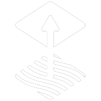

## Christos Galanopoulos - DevOps Engineer

Hey there! 👋 I'm Christos, a dedicated DevOps engineer and Microsoft MVP with a strong interest in technology. I constantly strive for improvement, exploring and mastering various tools and technologies that empower software development and cloud computing. Furthermore, I enjoy sharing information to increase public awareness of many topics. I strongly believe in the power of information dissemination and promoting a culture of continual learning.

### Skills & Expertise

- 💼 Experienced in architecting, automating, and optimizing mission-critical deployments across complex infrastructures.
- 🚀 Proficient in CI/CD pipelines, "as code" tools, cloud operations, container orchestration, and scripting.
- 🌐 Skilled in deploying and managing applications on various cloud platforms.
- 🔧 Dedicated to streamlining deployment workflows, ensuring reliable and scalable systems, and optimizing infrastructure for enhanced performance.
- 📚 Constantly learning and exploring new technologies.

  <picture>
    <source media="(prefers-color-scheme: light)" srcset="icons/black/azure.webp">
    
  </picture>
  <picture>
    <source media="(prefers-color-scheme: light)" srcset="icons/black/github.webp">
    
  </picture>
  <picture>
    <source media="(prefers-color-scheme: light)" srcset="icons/black/kubernetes.webp">
    
  </picture>
  <picture>
    <source media="(prefers-color-scheme: light)" srcset="icons/black/bicep.webp">
    
  </picture>
  <picture>
    <source media="(prefers-color-scheme: light)" srcset="icons/black/terraform.webp">
    
  </picture>
  <picture>
    <source media="(prefers-color-scheme: light)" srcset="icons/black/go.webp">
    
  </picture>
  <picture>
    <source media="(prefers-color-scheme: light)" srcset="icons/black/flux.webp">
    
  </picture>
  <picture>
    <source media="(prefers-color-scheme: light)" srcset="icons/black/python.webp">
    
  </picture>
  <picture>
    <source media="(prefers-color-scheme: light)" srcset="icons/black/c.webp">
    
  </picture>
  <picture>
    <source media="(prefers-color-scheme: light)" srcset="icons/black/cpp.webp">
    
  </picture>
  <picture>
    <source media="(prefers-color-scheme: light)" srcset="icons/black/linux.webp">
    
  </picture>

  
  
  

<picture>
  <source media="(prefers-color-scheme: light)" srcset="https://raw.githubusercontent.com/GiorgosXou/Random-stuff/main/Programming/StackOverflow/Answers/70200610_11465149/w.png">
  <source media="(prefers-color-scheme: dark)" srcset="https://raw.githubusercontent.com/GiorgosXou/Random-stuff/main/Programming/StackOverflow/Answers/70200610_11465149/b.png">
</picture>
